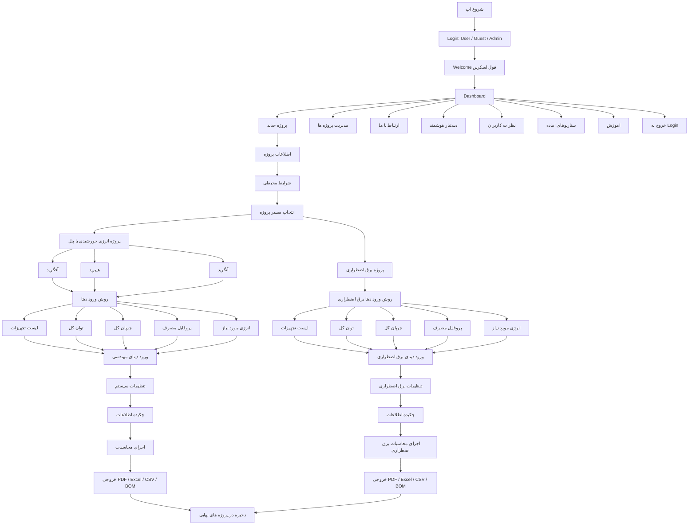

# SHIL Final Flowchart

```mermaid
flowchart TD
A[شروع اپ] --> B[Login: User / Guest / Admin]
B --> C[Welcome فول اسکرین]
C --> D[Dashboard]
D --> NP[پروژه جدید]
D --> PM[مدیریت پروژه ها]
D --> CT[ارتباط با ما]
D --> AI[دستیار هوشمند]
D --> FB[نظرات کاربران]
D --> SC[سناریوهای آماده]
D --> ED[آموزش]
D --> LO[خروج به Login]
NP --> P1[اطلاعات پروژه]
P1 --> P2[شرایط محیطی]
P2 --> P3[انتخاب مسیر پروژه]
P3 --> SOL[پروژه انرژی خورشیدی با پنل]
P3 --> EM[پروژه برق اضطراری]
SOL --> S1[آفگرید]
SOL --> S2[هیبرید]
SOL --> S3[آنگرید]
S1 --> M[روش ورود دیتا]
S2 --> M
S3 --> M
EM --> M2[روش ورود دیتا برق اضطراری]
M --> IM1[لیست تجهیزات]
M --> IM2[توان کل]
M --> IM3[جریان کل]
M --> IM4[پروفایل مصرف]
M --> IM5[انرژی مورد نیاز]
M2 --> IM1E[لیست تجهیزات]
M2 --> IM2E[توان کل]
M2 --> IM3E[جریان کل]
M2 --> IM4E[پروفایل مصرف]
M2 --> IM5E[انرژی مورد نیاز]
IM1 --> IN[ورود دیتای مهندسی]
IM2 --> IN
IM3 --> IN
IM4 --> IN
IM5 --> IN
IM1E --> INE[ورود دیتای برق اضطراری]
IM2E --> INE
IM3E --> INE
IM4E --> INE
IM5E --> INE
IN --> SYS[تنظیمات سیستم]
INE --> SYSE[تنظیمات برق اضطراری]
SYS --> SUM[چکیده اطلاعات]
SYSE --> SUME[چکیده اطلاعات]
SUM --> RUN[اجرای محاسبات]
SUME --> RUNE[اجرای محاسبات برق اضطراری]
RUN --> OUT[خروجی PDF / Excel / CSV / BOM]
RUNE --> OUTE[خروجی PDF / Excel / CSV / BOM]
OUT --> FINAL[ذخیره در پروژه های نهایی]
OUTE --> FINAL
```
